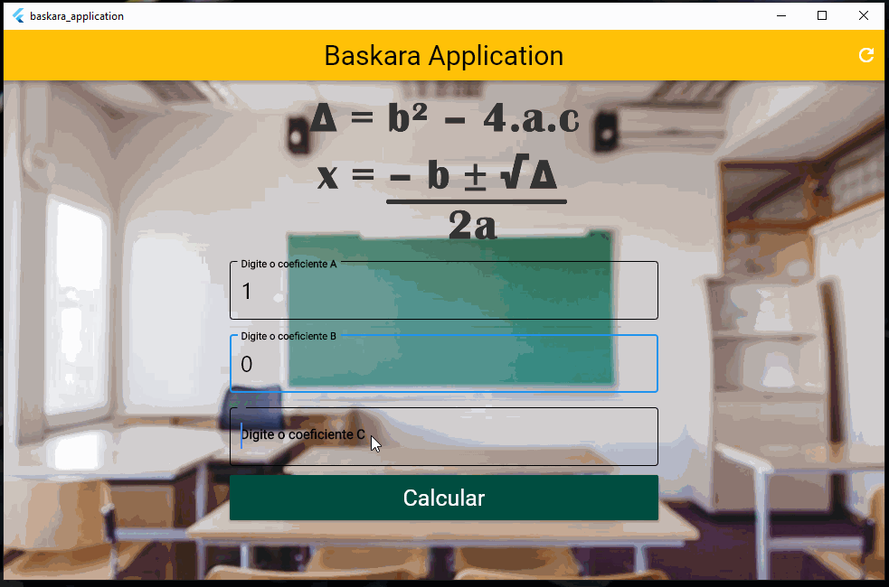

# Baskara Application

***
Projeto feito totalmente em Flutter, framework da linguagem Dart. 
* Este projeto foi feito para Windows utilizando o Flutter Desktop 
* Este projeto depende de componentes externos ao flutter para funcionar (relatados ao final do documento)
### **Intuito**
***
O Intuito do projeto era criar algoritmos que tinha feito no Visualg só que em Flutter Windows Desktop.
___
___
### Explicação do App 
O aplicativo tem por finalidade resolver a fórmula de baskara (recebendo os coeficientes a,b e c da fórmula). 
&nbsp;
A seguir a fórmula de baskara, segundo o site: [Brasil Escola](https://brasilescola.uol.com.br/matematica/demonstracao-formula-bhaskara.htm)
>A fórmula de Bhaskara é um método resolutivo para equações do segundo grau cujo nome homenageia o grande matemático indiano que a demonstrou. Essa fórmula nada mais é do que um método para encontrar as raízes reais de uma equação do segundo grau fazendo uso apenas de seus coeficientes. 

&nbsp;

Fórmula de baskara   |
--------- |
 | &nbsp;
### Explicando o Código &nbsp;
Agora terá explicação das variáveis utilizadas.

*  **final TextEditingController aController = TextEditingController();** = variável controladora atrelada ao TexFormField, para pegar o valor digitado n campo de Coeficiente(A).
* **final TextEditingController bController = TextEditingController();** = variável controladora atrelada ao TexFormField, para pegar o valor digitado n campo de Coeficiente(B).
* **final TextEditingController cController = TextEditingController();** = variável controladora atrelada ao TexFormField, para pegar o valor digitado n campo de Coeficiente(C).
* **GlobalKey<FormState> _formKey = GlobalKey<FormState>();** = uma Key para atrelar ao form.
* **double x1;** = variável to tipo double para receber valor de X1.
* **double x2;** = variável to tipo double para receber valor de X2.
* **double delta;** = Variável do tipo double para receber valor de delta.
* **String infoText;** = variável do tipo string para informa os resultados da equação.
* **double coeA = double.parse(aController.text);** = variável do tipo double para transformar o texto pego pelo controller aController em um tipo double.
* **double coeB = double.parse(bController.text);** = variável do tipo double para transformar o texto pego pelo controller bController em um tipo double.
* **double coeC = double.parse(cController.text);** = variável do tipo double para transformar o texto pego pelo controller cController em um tipo double.
&nbsp; 
### Método
Agora terá explicação dos métodos utilizados para controle do aplicativo. &nbsp; 
##### Método de Calcular 
&nbsp;

    void _calculate() {
        setState(() {
          double coeA = double.parse(aController.text);
          double coeB = double.parse(bController.text);
          double coeC = double.parse(cController.text);
          delta = (coeB * coeB) - (4 * coeA * coeC);
          if ((delta < 0) || (coeA == 0)) {
            infoText = "Esta equação nao possui raizes reais.";
          } else {
            x1 = (-coeB + sqrt(delta)) / (2 * coeA);
            x2 = (-coeB - sqrt(delta)) / (2 * coeA);
            infoText =
                "X1 = (${x1.toStringAsPrecision(5)})\n X2 = (${x2.toStringAsPrecision(5)})";
          }
        });
      }

> Esse método foi criado para o botão de de calcular(Raised Button) que esta na body da aplicação, onde fará todo a conversão dos controladores que pegam o texto dos TextFormFields transformando os em variáveis do tipo double, o método também calcular o delta, checa a condição do delta e coeficiente A para então realizar o calculo do X1 e X2.

&nbsp;
##### Método de resetar
Agora será mostrado os widgets do flutter que foram utilizados para compor essa simples aplicação:

    void _clear() {
    setState(() {
      aController.text = "";
      bController.text = "";
      cController.text = "";
      infoText = "";
      _formKey = GlobalKey<FormState>();
    });
    }
      
> Esse método foi criado para o botão de reset que tem na appBar , onde fará a limpeza dos campos de inputs, e da informação dada com os dados anteriores.

&nbsp;
## Widgets Utilizados
***
Agora será mostrado os widgets do flutter que foram utilizados para compor essa simples aplicação:

  - Scalffold: utilizado para fazer a appBar e desenvolvimento da base do aplicativo.
- AppBar: utilizado para a definição do nome e da barra do aplicativo.
- Icon Button: utilizado para fazer o botão de resetear.
- Icon: utilizado juntamente com o Icon Button para atribuição do botão, deixando com uma iconografia reconhecida pelas pessoas.
- SingreChildScrollView: utilizado para que se precisasse de mais espaço, houvesse um scroll, não impedindo o usuário de ver as informações.
- Form: utilizado para fazer o formulário e as verificações.
- Padding: utilizado para o espaçamento de cada item.
- Column: utilizado para o posicionamento dos elementos na tela.
- TextFormField: utilizado para fazer os input.
- Container: utilizado para dar espaçamento ao botão Calcular.
- Raised Button: utilizado para o botão calcular e atribuir função a ele.
- Text: utilizado para o texto das informações abaixo do botão calcular.
- Divider: utilizado para gerar espaço entre os TextFormField

# Imagem da Aplicação
Agora será mostrado como ficou a aplicação e layout feito por mim.

&nbsp;

### Instalação
Este projeto requer além do flutter, algumas ferramentas e componentes instalados, estes são: 
- Visual Studio Community 2019 e seus componetes abaixo:
    - MS build
    - MSVC v142 -vs2019 C++ x64/x86 build tools (v14.25)
    - Windows 10 SDK (10.0.177630)
- Clone este repositorio atráves do terminal, VS Code ou Android Studio,

Obs; **A instalação dos componentes é feita diretamente do Visual Studio Community 2019 na aba componentes.**

## Autor
***
> William Silva -> [Site e portfolio pessoal](https://bywilliams.github.io/portfolio/)

**Agradeço por terem acompanhdo a documentação e a explicação deste pequeno projeto, e trarei mais projetos.**

